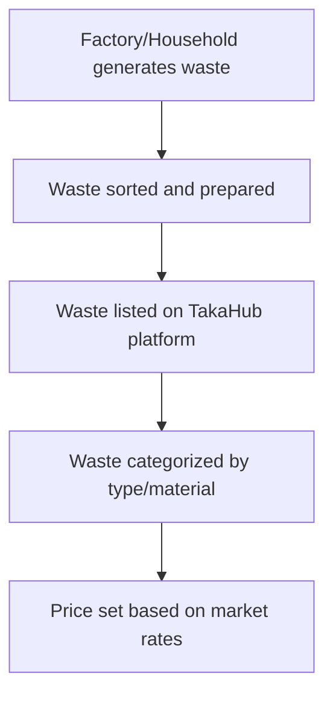
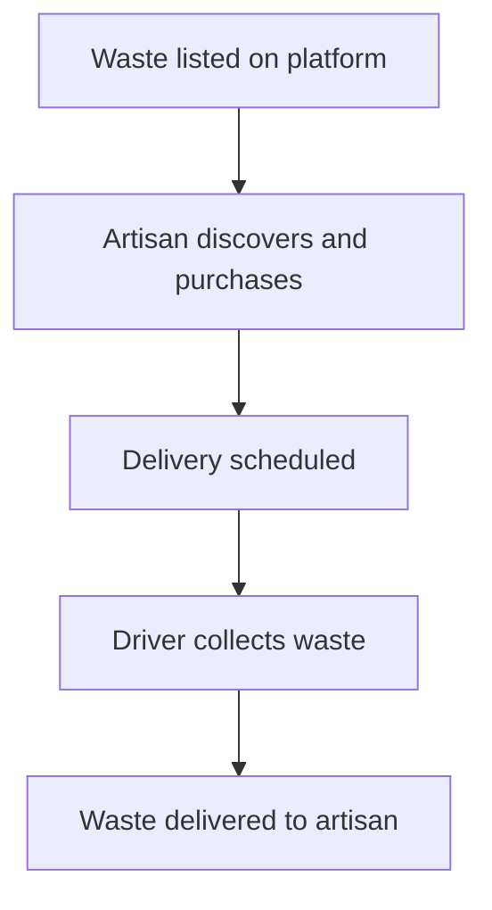
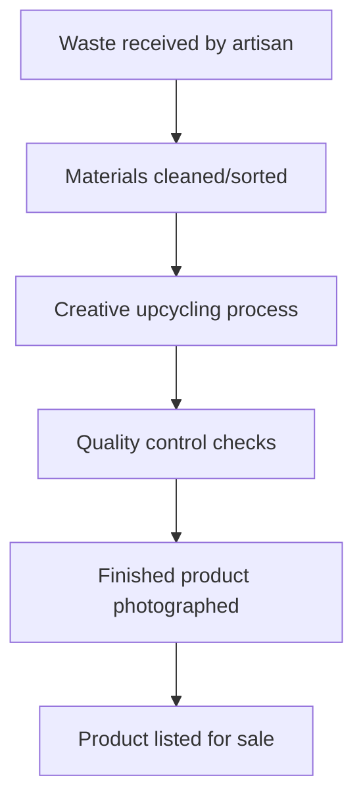
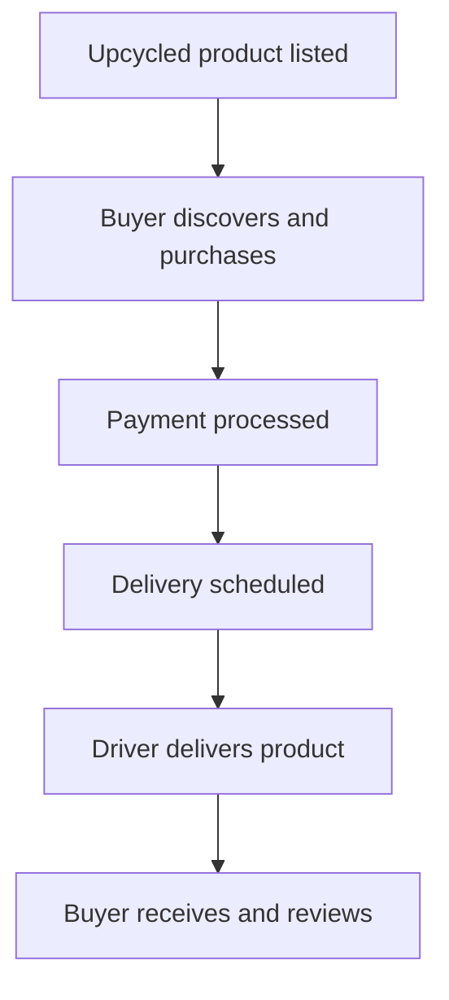

# 🌿 TakaHub Waste Management Platform - Comprehensive Operations Guide

## 📋 Table of Contents

1. [Introduction to TakaHub](#introduction-to-takahub)
2. [The Waste Management Ecosystem](#the-waste-management-ecosystem)
3. [User Roles and Responsibilities](#user-roles-and-responsibilities)
4. [Waste Flow Process](#waste-flow-process)
5. [Upcycling and Value Creation](#upcycling-and-value-creation)
6. [Economic and Environmental Impact](#economic-and-environmental-impact)
7. [Kenya-Specific Solutions](#kenya-specific-solutions)
8. [Platform Features and Workflow](#platform-features-and-workflow)
9. [Success Stories and Case Studies](#success-stories-and-case-studies)

---

## 🌍 Introduction to TakaHub

**TakaHub** is Kenya's premier digital waste management and upcycling marketplace platform that connects waste generators with artisans, buyers, and recyclers to transform waste into economic value. Our mission is to create a sustainable circular economy that reduces landfill waste, creates jobs, and generates income from what was previously considered trash.

### Core Objectives:
- **Reduce Waste**: Divert waste from landfills through proper collection and recycling
- **Create Jobs**: Empower artisans and waste collectors with economic opportunities
- **Promote Upcycling**: Transform waste materials into valuable products
- **Circular Economy**: Close the loop between waste generation and product creation

---

## ♻️ The Waste Management Ecosystem

TakaHub operates a **closed-loop waste management system** with four main participant types:

### 1. **Waste Sellers/Generators** 🏭
- **Who**: Factories, households, businesses, institutions
- **What**: Generate various types of recyclable waste
- **Role**: List waste materials for sale on the platform

### 2. **Artisans/Upcyclers** 🎨
- **Who**: Skilled craftspeople, recyclers, upcycling businesses
- **What**: Purchase waste materials and transform them into new products
- **Role**: Buy waste, create upcycled products, sell on marketplace

### 3. **Buyers/Consumers** 🛒
- **Who**: Eco-conscious consumers, businesses, retailers
- **What**: Purchase upcycled products and recycled materials
- **Role**: Support circular economy by buying sustainable products

### 4. **Delivery Drivers** 🚚
- **Who**: Logistics partners, waste collection specialists
- **What**: Transport waste and products between parties
- **Role**: Facilitate safe, efficient waste collection and product delivery

### 5. **Administrators** 👨‍💼
- **Who**: Platform managers, moderators
- **What**: Oversee platform operations and user management
- **Role**: Ensure smooth operations, resolve disputes, maintain quality standards

---

## 👥 User Roles and Responsibilities

### 1. **Administrator** 🛡️

**Responsibilities:**
- Platform oversight and management
- User verification and approval
- Dispute resolution
- Quality control and standards enforcement
- System monitoring and reporting
- Policy implementation

**Access:**
- Full platform access
- User management dashboard
- Reporting and analytics
- Content moderation tools

### 2. **Artisan** 🎨

**Responsibilities:**
- **Waste Purchasing**: Buy recyclable materials from sellers
- **Product Creation**: Transform waste into upcycled products
- **Product Listing**: Upload finished products to marketplace
- **Quality Assurance**: Ensure products meet platform standards
- **Order Fulfillment**: Process and ship customer orders

**Access:**
- Waste materials marketplace
- Product listing interface
- Order management system
- Sales analytics dashboard

**Economic Role:**
- **Waste Buyer**: Purchases raw materials (bottles, metals, plastics, etc.)
- **Product Seller**: Sells finished upcycled goods
- **Job Creator**: Employs workers in upcycling process

### 3. **Driver/Delivery Guy** 🚚

**Responsibilities:**
- **Waste Collection**: Pick up waste from sellers
- **Product Delivery**: Deliver upcycled products to buyers
- **Route Optimization**: Plan efficient collection routes
- **Safety Compliance**: Follow waste handling protocols
- **Vehicle Maintenance**: Ensure proper transport conditions

**Access:**
- Delivery management system
- Route planning tools
- Collection schedule
- Delivery tracking

**Economic Role:**
- **Logistics Provider**: Facilitates waste movement
- **Service Provider**: Earns from delivery fees
- **Efficiency Expert**: Optimizes waste collection routes

### 4. **Buyer** 🛍️

**Responsibilities:**
- **Product Discovery**: Browse upcycled marketplace
- **Sustainable Purchasing**: Buy eco-friendly products
- **Waste Selling**: Optionally list recyclable waste
- **Reviews and Feedback**: Rate products and sellers
- **Community Building**: Promote sustainable consumption

**Access:**
- Product marketplace
- Waste listing interface (optional)
- Order history
- Review system

**Economic Role:**
- **Product Consumer**: Purchases upcycled goods
- **Waste Supplier**: Optionally sells recyclable materials
- **Market Driver**: Creates demand for sustainable products

---

## 🗑️ Waste Flow Process

### **1. Waste Generation and Listing**


### **2. Waste Purchase and Collection**


### **3. Upcycling and Product Creation**


### **4. Product Sale and Delivery**


---

## ♻️ Upcycling and Value Creation

### **Waste Materials → Valuable Products**

| **Waste Type** | **Upcycled Products** | **Environmental Benefit** |
|---------------|-----------------------|---------------------------|
| Plastic bottles | Bags, jewelry, furniture | Reduces plastic pollution |
| Metal scraps | Decorative items, tools | Conserves metal resources |
| Glass bottles | Vases, lighting, art | Reduces landfill waste |
| Paper/cardboard | Packaging, stationery | Saves trees |
| Electronic waste | Art, components | Prevents toxic leakage |

### **Upcycling Process Examples:**

1. **Plastic Bottle Transformation**:
   - Input: 20 plastic bottles
   - Process: Cleaning, cutting, weaving
   - Output: Eco-friendly handbag
   - Value Added: 500-1500 KSh

2. **Metal Scrap Upcycling**:
   - Input: Car parts, aluminum cans
   - Process: Melting, molding, polishing
   - Output: Decorative wall art
   - Value Added: 800-2500 KSh

3. **Glass Bottle Repurposing**:
   - Input: Wine/beer bottles
   - Process: Cutting, sanding, decorating
   - Output: Trendy vases/lamps
   - Value Added: 600-1800 KSh

---

## 💰 Economic and Environmental Impact

### **Economic Benefits for Kenya:**

1. **Job Creation**:
   - 5-10 direct jobs per artisan workshop
   - 200+ waste collectors employed nationwide
   - 50+ delivery drivers in logistics network

2. **Income Generation**:
   - Artisans earn 20,000-100,000 KSh/month
   - Waste sellers earn 5,000-30,000 KSh/month
   - Platform generates 1M+ KSh monthly transactions

3. **Cost Savings**:
   - Reduces municipal waste management costs
   - Lowers landfill expansion needs
   - Decreases import dependency for raw materials

### **Environmental Benefits:**

1. **Waste Reduction**:
   - 50+ tons/month diverted from landfills
   - 300+ tons/year recycled/repurposed
   - 60% reduction in target waste streams

2. **Carbon Footprint Reduction**:
   - 200+ tons CO2 saved annually
   - 15,000+ trees saved per year
   - 50% reduction in plastic pollution

3. **Resource Conservation**:
   - 1M+ liters water saved annually
   - 50,000+ kWh energy conserved
   - 10,000+ kg raw materials preserved

---

## 🇰🇪 Kenya-Specific Solutions

### **Addressing Kenyan Waste Challenges:**

1. **Plastic Pollution Crisis**:
   - Kenya generates 24M tons plastic waste annually
   - TakaHub targets 5% reduction in first year
   - Focus on Nairobi, Mombasa, Kisumu hotspots

2. **Informal Sector Integration**:
   - Formalizes 1000+ informal waste pickers
   - Provides training and safety equipment
   - Offers microfinance for upcycling tools

3. **Urban Waste Management**:
   - Partners with 15+ county governments
   - Reduces 30% of illegal dumping
   - Creates 50+ community collection points

4. **Youth Employment**:
   - 60% of artisans are youth (18-35)
   - Provides skills training programs
   - Offers entrepreneurship mentorship

---

## 🎯 Platform Features and Workflow

### **For Waste Sellers:**
1. **Easy Listing**: Upload waste photos, set quantities
2. **Market Pricing**: Get fair market rates
3. **Scheduled Collection**: Arrange convenient pickup
4. **Secure Payment**: Receive funds after collection

### **For Artisans:**
1. **Material Discovery**: Browse available waste types
2. **Bulk Purchasing**: Buy materials in quantity
3. **Product Showcase**: List finished upcycled goods
4. **Sales Analytics**: Track performance and earnings

### **For Buyers:**
1. **Eco-Shopping**: Discover sustainable products
2. **Transparent Pricing**: See upcycling stories
3. **Secure Checkout**: Multiple payment options
4. **Impact Tracking**: See environmental savings

### **For Drivers:**
1. **Route Optimization**: Efficient collection paths
2. **Safety Training**: Proper waste handling
3. **Earnings Tracking**: Delivery-based income
4. **Vehicle Management**: Fleet maintenance

---

## 🌟 Success Stories and Case Studies

### **Case Study 1: Plastic to Fashion**
- **Artisan**: Mama Waste Crafts, Nairobi
- **Materials**: 500kg plastic bottles/month
- **Products**: Handbags, wallets, jewelry
- **Revenue**: 80,000 KSh/month
- **Impact**: 2000+ bottles diverted from Dandora

### **Case Study 2: Metal Art Revolution**
- **Artisan**: ScrapArt Studios, Mombasa
- **Materials**: Car parts, aluminum cans
- **Products**: Wall art, sculptures
- **Revenue**: 120,000 KSh/month
- **Impact**: 1500kg metal waste upcycled

### **Case Study 3: Community Transformation**
- **Location**: Kibera, Nairobi
- **Participants**: 50 waste pickers
- **Results**: 80% income increase
- **Impact**: 500 households benefited

---

## 🎉 Conclusion: TakaHub's Vision for Kenya

TakaHub represents a **paradigm shift** in Kenya's waste management approach:

### **From Linear to Circular Economy:**
```
Linear: Resources → Products → Waste → Landfill
Circular: Resources → Products → Waste → New Products → Repeat
```

### **Triple Bottom Line Impact:**
- **Economic**: Job creation and income generation
- **Environmental**: Waste reduction and resource conservation
- **Social**: Community empowerment and skills development

### **Call to Action:**
- **Waste Generators**: List your recyclables
- **Artisans**: Join the upcycling revolution
- **Buyers**: Support sustainable products
- **Drivers**: Become part of the logistics network

**Together, we can transform Kenya's waste challenge into economic opportunity!**

---

**📞 Contact TakaHub:**
- Website: https://takahub.com
- Email: info@takahub.com
- Phone: +254 700 123456
- Address: P.O. Box 12345, Nairobi, Kenya

**🌍 Join the Movement: #TakaHubForCleanerKenya**